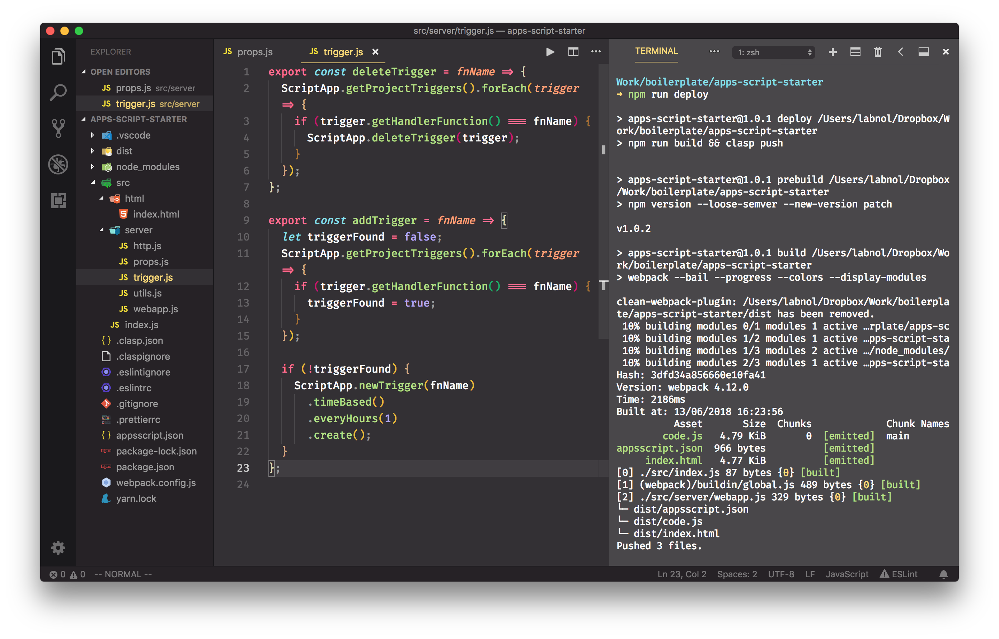

# Google Apps Script Development 💯

Thanks to [Amit Agarwal of labnol](labnol.org) for the initial steps in this repo and the starting template.

The Google Apps Script Starter kit supports the new **V8 JavaScript runtime** that powers Chrome and Node.js. You can write code using modern ECMAScript syntax like Arrow functions, Classes, Template Literals, Destructuring and more.

It is recommended that you install the [Extension Pack](https://marketplace.visualstudio.com/items?itemName=labnol.google-apps-script) for working with Apps Script files in VS Code.

You can build Google Workspace add-ons (for Google Docs, Slides, Gmail and Google Sheets), web applications and workflow automation routines with next-generation JavaScript.

You also need to install Node.js which includes the npm package manager.

### :package: Getting Started

**1.** Clone the repository and install npm dependencies and [utilities](TOOLS.md).

